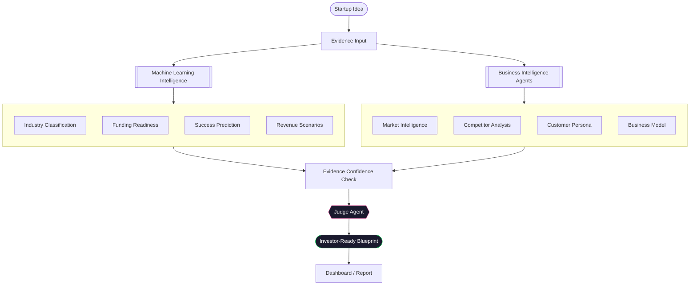
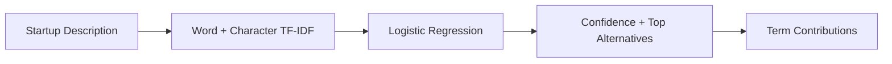
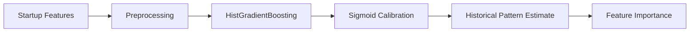
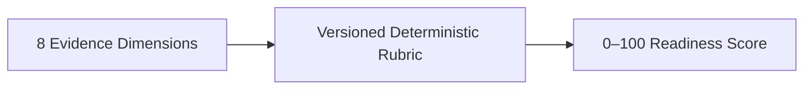
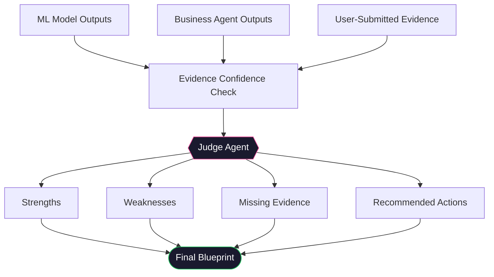
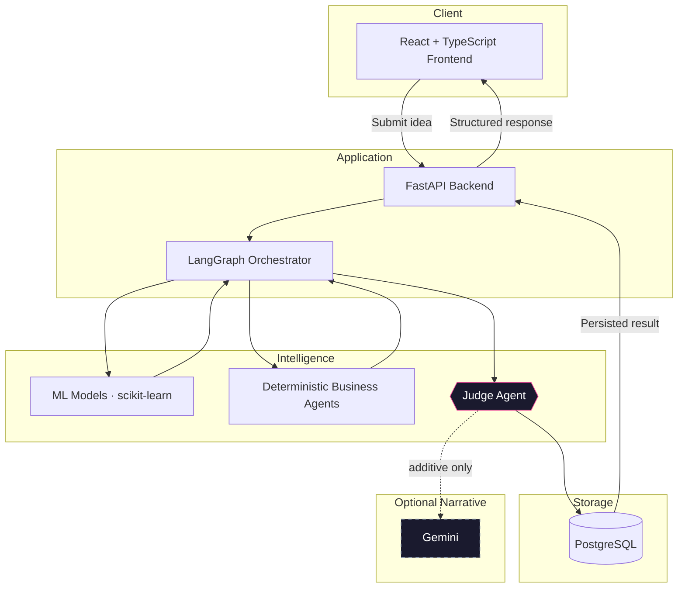
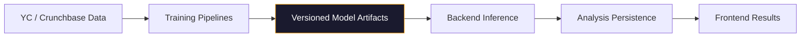
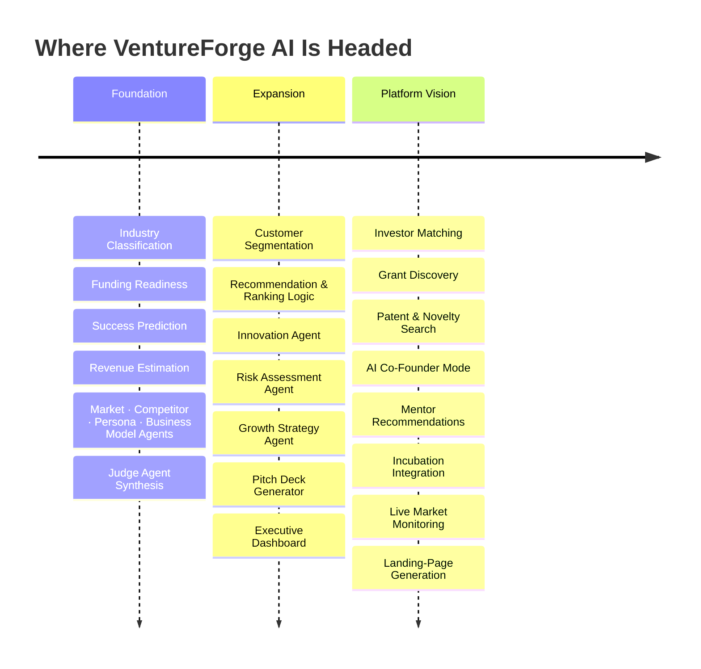

<div align="center">


### From Idea to Investor-Ready Startup in Minutes

Turn one startup idea into a structured startup blueprint — using trained Machine Learning models, specialized business-intelligence agents, explainable scoring, and a deterministic Judge Agent that synthesizes it all into one verdict.

[](https://github.com/DivyaShreeS09/VentureForge-AI/actions/workflows/ci.yml)


<!-- Add hero banner at docs/assets/hero-banner.png (recommended 1600x700) -->

**[Preview](#screenshots--demo)** &nbsp;·&nbsp; **[Product Journey](#product-journey)** &nbsp;·&nbsp; **[AI Workflow](#multi-agent-workflow)** &nbsp;·&nbsp; **[Machine Learning](#machine-learning)** &nbsp;·&nbsp; **[Architecture](#architecture)** &nbsp;·&nbsp; **[Quick Start](#quick-start)**

</div>

<br/>

## The Problem

Validating a startup idea today means becoming your own research team. One tool for market sizing. Another for competitor research. A spreadsheet for revenue scenarios. A friend, or a chatbot, for a gut check on whether any of it holds together — and neither will tell you what they actually don't know.

**Most startup tools answer questions. VentureForge AI builds a structured decision path.**

A single idea normally has to pass through separate, disconnected steps to become a real evaluation:

`idea validation` → `industry positioning` → `funding readiness` → `success-pattern analysis` → `revenue scenarios` → `market analysis` → `competitor analysis` → `customer personas` → `business-model design` → `final decision`

VentureForge AI connects every one of those steps into a single workflow — one idea in, one structured, evidence-backed blueprint out.

## Product Journey



Both branches run on real logic — trained models on the ML side, evidence-bound deterministic agents on the business-intelligence side — and converge on one synthesis step. Nothing about the final blueprint comes from a single, unaccountable model.

### An Illustrative Walkthrough

> Input: *"An AI platform for early diabetic-foot risk detection."*

| Stage | Output |
|---|---|
| Industry Classification | → predicted category, e.g. HealthTech, with a confidence score |
| Funding Readiness | → structured score generated from submitted evidence |
| Success Pattern | → calibrated historical-pattern estimate, not a guarantee |
| Revenue | → conservative / base / optimistic scenarios from your own assumptions |
| Market Intelligence | → opportunity signals and explicit evidence gaps |
| Customer Persona | → likely early-adopter profile built from submitted evidence |
| Judge Agent | → strengths, weaknesses, missing evidence, next actions |
| Output | → one investor-ready startup blueprint |

*Illustrative example — actual scores depend entirely on the evidence you submit, not a fixed demo value.*

## Product Capabilities

<table>
<tr><th>Machine Learning Intelligence</th><th>Business Intelligence Agents</th></tr>
<tr><td>

- Industry Classification
- Success Pattern Prediction
- Funding Readiness Scoring
- Revenue Scenario Modeling

</td><td>

- Market Intelligence
- Competitor Analysis
- Customer Persona Generation
- Business Model Synthesis

</td></tr>
<tr><th>Decision Intelligence</th><th>Product Experience</th></tr>
<tr><td>

- Model Explainability
- Confidence & Abstention
- Evidence Confidence Checks
- Judge Agent Synthesis

</td><td>

- React Interface with Live Workflow Progress
- Structured, Unified Results View
- Persistent Analysis History
- Reusable, Report-Ready Output

</td></tr>
</table>

## Why Not Just Use a Chatbot?

| | Generic Chatbot | VentureForge AI |
|---|---|---|
| Interaction | A single conversational response | A structured, multi-stage pipeline |
| Prediction | An LLM-generated opinion | Trained ML models, evaluated on held-out data |
| Funding analysis | A subjective narrative | A versioned, deterministic scoring rubric |
| Success signal | Usually absent | A calibrated, historical-pattern estimate |
| Confidence | Rarely measured | Calibration measured and reported for every model |
| Explainability | An opaque narrative | Model-level contributions and cited evidence |
| Missing information | A plausible-sounding guess | Reported explicitly as an evidence gap |
| Output | General advice | A reusable, structured startup blueprint |

## Multi-Agent Workflow

A deterministic LangGraph pipeline. Every submission runs the same nodes, in the same order, with a fully traced execution path and a shared workflow state.

```mermaid
graph LR
    A[Input Validation] --> B[Industry Classification]
    B --> C[Funding Readiness]
    C --> D[Success Prediction]
    D --> E[Revenue Estimation]
    E --> F[Market Intelligence]
    F --> G[Competitor Analysis]
    G --> H[Customer Persona]
    H --> I[Business Model]
    I --> J[Evidence Confidence Check]
    J --> K{{Judge Agent}}
    K --> L[Persistence]
    L --> M[Frontend Response]

    A -. invalid input .-> X[Invalid Input Handler]
    X --> L

    style K fill:#1a1a2e,stroke:#ec4899,color:#fff
    style M fill:#1a1a2e,stroke:#22c55e,color:#fff
```



Invalid submissions route to a dedicated handler instead of failing silently — every path through the graph ends at the same persistence step.

## Machine Learning


Every model is trained on a real, licensed dataset, evaluated on data it never saw during training or model selection, and shipped with full metadata — metrics, feature schema, library versions, and training command.

### Industry Classifier



| Metric | Result |
|---|---|
| Categories | 7, derived from real Y Combinator company data |
| Held-out test macro F1 | **0.776** |
| Independent gold-set macro F1 | **0.766** |
| Top-2 accuracy | **0.945** |

Top-2 accuracy matters here because neighboring industries (fintech vs. b2b software, for instance) genuinely overlap — a strong second-place candidate is a more honest signal than a single forced answer. Multiple text representations were evaluated for this task; TF-IDF remained the strongest validated choice for the current taxonomy.

### Success Predictor



| Metric | Result |
|---|---|
| Training data | Real, resolved Crunchbase outcomes |
| Test ROC-AUC | **0.855** |
| Test F1 | **0.795** |
| Calibration | Sigmoid |

Calibration matters because a probability is only useful if it means what it claims — a "70% likely" estimate should be right roughly 70% of the time, and that's measured directly rather than assumed. Framed deliberately as a historical-pattern estimate, since only companies with a resolved outcome are used for training — more honest than presenting it as a guarantee. Full methodology in [`ml/DATASETS.md`](ml/DATASETS.md).

### Funding Readiness



No dataset can defensibly predict "will an investor say yes" — so this is a fully auditable, versioned rubric rather than a model manufacturing false confidence.

### Trust, Built In

Confidence-based abstention flags a low-confidence prediction instead of forcing an answer — the system is designed to say "not sure" out loud.

## Judge Agent



The Judge Agent is the single point where everything converges. It reviews every model and agent output alongside the evidence the user actually supplied, separates real strengths from unverified assumptions, and reports what's missing instead of filling the gap with a plausible guess. An optional Gemini-generated narrative can sit on top of its verdict — purely additive, and never a substitute for the deterministic synthesis underneath it.

## Architecture



**Data and model lifecycle**



## Tech Stack

| Layer | Technology |
|---|---|
| Frontend | React · TypeScript · Vite · TailwindCSS |
| Backend | FastAPI · Pydantic · SQLAlchemy · Alembic |
| Orchestration | LangGraph |
| Machine Learning | scikit-learn · pandas · numpy · sentence-transformers |
| Database | PostgreSQL |
| Testing | pytest · Vitest · React Testing Library |
| Infrastructure | Docker Compose |
| Optional narrative layer | Google Gemini — additive only, never required |

## Repository Structure

```
VentureForge-AI/
├── backend/     FastAPI app — agents, orchestrator, API, ML-serving, migrations
├── frontend/     React + TypeScript app — results UI, typed API client
├── ml/            Training pipelines, feature engineering, evaluation, DATASETS.md
└── docs/          Extended architecture reference
```

## Screenshots & Demo

<!--
  Planned visual gallery — captures pending. Recommended assets and dimensions:
  docs/assets/hero-banner.png            (1600x700)
  docs/assets/demo.gif                   (< ~15 MB)
  docs/assets/screenshots/idea-input.png     (16:9 or 3:2)
  docs/assets/screenshots/workflow.png       (16:9 or 3:2)
  docs/assets/screenshots/results.png        (16:9 or 3:2)
  docs/assets/screenshots/explainability.png (16:9 or 3:2)
  docs/assets/screenshots/report.png         (16:9 or 3:2)
-->

| View | Description |
|---|---|
| Hero | The landing experience where the idea begins |
| Idea Intake | A focused form for the idea and optional evidence |
| Workflow Progress | Every agent, in order, with a visible execution trace |
| Industry & Funding Results | Classification and readiness score, side by side |
| Success Prediction | Calibrated probability with confidence band |
| Explainability | Why the model said what it said, in plain terms |
| Market Intelligence | Opportunity signals and evidence gaps |
| Judge Verdict | The final, synthesized decision |
| Blueprint / Report | The complete, reusable output |

## Quick Start

Two supported paths. Pick the one that fits your machine — both reach the same running app.

### Path A — Recommended: Docker for PostgreSQL

**1. Clone and configure**

```bash
git clone <repository-url>
cd VentureForge-AI
cp backend/.env.example backend/.env
cp frontend/.env.example frontend/.env
```
*Windows PowerShell:* use `Copy-Item` instead of `cp`.

**2. Start PostgreSQL in Docker**

```bash
docker compose up -d
```
*Expect:* `docker ps` shows a running `postgres` container on port `5432`.

**3. Install dependencies**

```bash
python -m venv backend/.venv
source backend/.venv/bin/activate        # Windows: backend\.venv\Scripts\Activate.ps1
pip install -r backend/requirements.txt -r ml/requirements.txt
cd frontend && npm install && cd ..
```

**4. Apply migrations**

```bash
cd backend && alembic upgrade head && cd ..
```
*Expect:* one or more `Running upgrade …` lines, no errors.

### Path B — Native PostgreSQL

**1–3.** Same as Path A, steps 1 and 3 (skip the Docker step).

**Create the database**

```bash
psql -U postgres -c "CREATE DATABASE ventureforge_ai;"
cd backend && alembic upgrade head && cd ..
```
*If `database already exists`:* safe to ignore and continue.

### Both paths converge here

**Verify or train the ML models** (only needed if `ml/models/` artifacts don't already exist)

```bash
python -m ml.src.training.train_industry_classifier
python -m ml.src.training.train_success_classifier
```
*Expect:* each ends with `Saved model + metadata to ml/models/...`. Without a downloaded real dataset, both fall back to a small generated bootstrap corpus — clearly logged, and never equivalent to the real-data metrics reported above (full detail in [`ml/DATASETS.md`](ml/DATASETS.md)).

**Run the app**

```bash
# Terminal 1
cd backend && uvicorn app.main:app --reload

# Terminal 2
cd frontend && npm run dev
```

| Service | URL |
|---|---|
| App | http://localhost:5173 |
| API docs | http://127.0.0.1:8000/docs |
| Health check | http://127.0.0.1:8000/api/v1/health |
| Model status | http://127.0.0.1:8000/api/v1/models/status |

### 60-Second Verification

- [ ] `/docs` opens and lists live endpoints
- [ ] `/api/v1/health` returns a success response
- [ ] `/api/v1/models/status` reports loaded model versions
- [ ] The frontend loads at `localhost:5173`
- [ ] `alembic current` shows the latest migration head
- [ ] A sample startup idea can be submitted and returns a full analysis

### Common Fixes

| Problem | Fix |
|---|---|
| PowerShell blocks the venv activation script | `Set-ExecutionPolicy -Scope Process RemoteSigned` |
| `python` not found | Use `python3`, or confirm Python 3.12 is on PATH |
| `npm` not found | Install Node.js 20 and reopen your terminal |
| PostgreSQL connection refused | Confirm the container/service is running and the port matches `DATABASE_URL` |
| Password authentication failed | Match `DATABASE_URL` to the password you set during install |
| `database already exists` | Safe to ignore — continue to the next step |
| Alembic import/path error | Run `alembic` commands from inside `backend/`, not the repo root |
| Missing model artifact | Run the training commands in the step above |
| Port 8000 already in use | Stop the conflicting process, or run `uvicorn` with `--port` |
| Port 5173 already in use | Stop the conflicting process, or set a different Vite port |
| Frontend can't reach the backend | Check `VITE_API_BASE_URL` in `frontend/.env` |
| No Kaggle credentials | Only required to re-download raw datasets — training still runs on the bootstrap corpus without them |
| No Gemini key | Optional by design — the full deterministic pipeline works without it |

## Configuration

| Variable | Location | Purpose |
|---|---|---|
| `DATABASE_URL` | `backend/.env` | PostgreSQL connection string |
| `GEMINI_API_KEY` | `backend/.env` | Optional narrative layer |
| `GEMINI_MODEL` | `backend/.env` | e.g. `gemini-2.0-flash` |
| `VITE_API_BASE_URL` | `frontend/.env` | Backend API base URL |
| Kaggle credentials | `~/.kaggle/kaggle.json` | Only needed to re-download raw ML training data |

## Running

| Mode | Command |
|---|---|
| Backend (dev) | `uvicorn app.main:app --reload` — from `backend/` |
| Frontend (dev) | `npm run dev` — from `frontend/` |
| Frontend (production build) | `npm run build` — from `frontend/` |
| Train industry classifier | `python -m ml.src.training.train_industry_classifier` |
| Train success predictor | `python -m ml.src.training.train_success_classifier` |
| Backend tests | `pytest` — from `backend/` |
| ML tests | `pytest tests` — from `ml/` |
| Frontend tests | `npm run test` — from `frontend/` |
| Integration tests | `pytest tests/integration` |

## The Future of VentureForge



**Foundation** is what's running today — trained, evaluated, and tested. **Expansion** is the next layer of business-intelligence modules. **Platform Vision** is the complete path this project is building toward: an AI-native path from a single idea to a fully investor-ready company. Every module that ships holds itself to the same bar the foundation already does — real evaluation, not a fabricated number.

## Acknowledgements

Built with [FastAPI](https://fastapi.tiangolo.com/), [React](https://react.dev/), [LangGraph](https://langchain-ai.github.io/langgraph/), [scikit-learn](https://scikit-learn.org/), [PostgreSQL](https://www.postgresql.org/), [SQLAlchemy](https://www.sqlalchemy.org/), [Alembic](https://alembic.sqlalchemy.org/), and [TailwindCSS](https://tailwindcss.com/).
