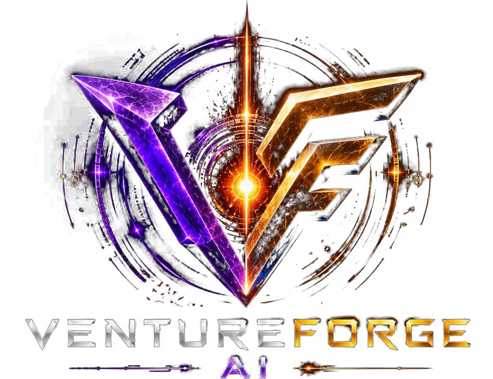
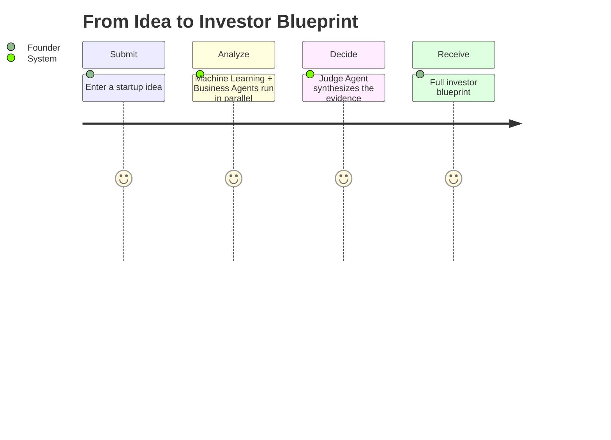
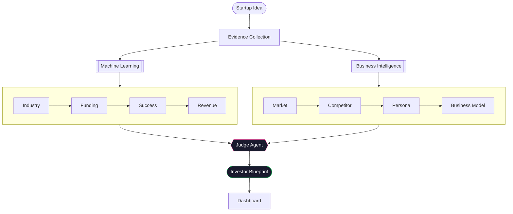
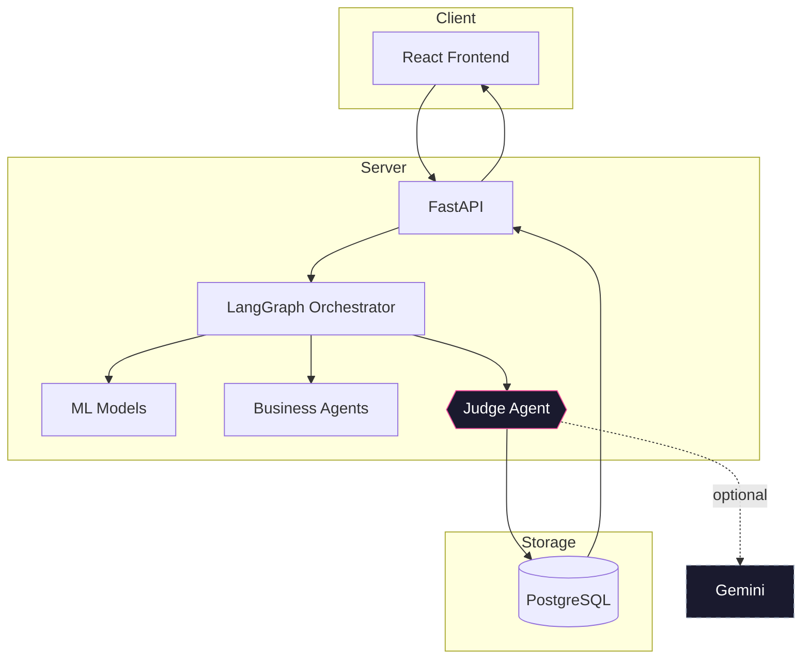
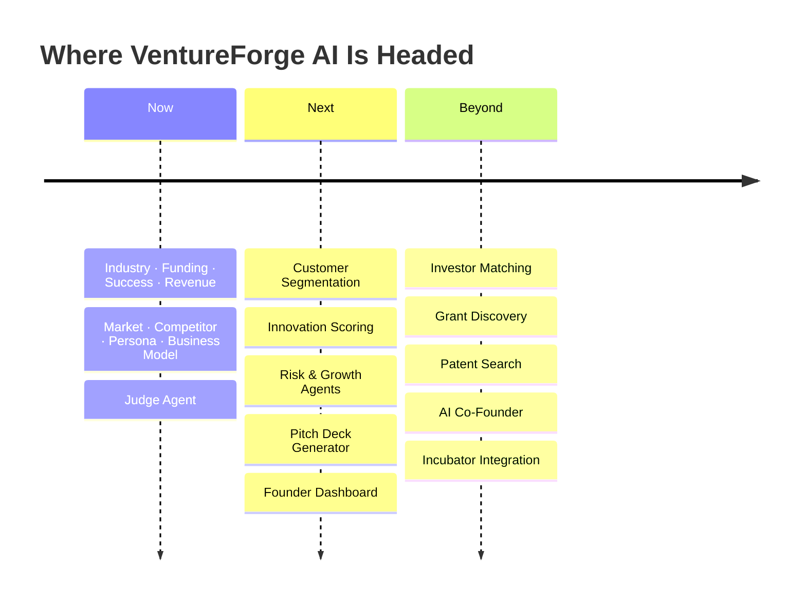

<div align="center">



### From Idea to Investor-Ready Startup in Minutes

Turn one startup idea into a full investor blueprint — industry fit, funding readiness, success signal, revenue outlook, market position, and a final verdict.

[](https://github.com/DivyaShreeS09/VentureForge-AI/actions/workflows/ci.yml)


<!-- Add hero banner at docs/assets/hero-banner.png (recommended 1600x700) -->

**[Preview](#screenshots)** · **[Product Journey](#product-journey)** · **[AI Workflow](#the-ai-workflow)** · **[Machine Learning](#machine-learning)** · **[Architecture](#architecture)** · **[Quick Start](#quick-start)**

</div>

<br/>

## The Problem

Validating a startup idea usually means a dozen scattered tools and a friend's opinion. Nothing tells you what it actually doesn't know.

**Most startup tools answer questions. VentureForge AI builds a decision path.**

## Product Journey



### A Walkthrough

> *"An AI platform for early diabetic-foot risk detection."*

| Stage | What Comes Back |
|---|---|
| Industry | HealthTech, with a confidence score |
| Funding Readiness | A structured score built from your evidence |
| Success Signal | A calibrated estimate against historical outcomes |
| Revenue | Conservative / base / optimistic scenarios |
| Market & Persona | Opportunity signals and likely early adopters |
| Judge Agent | Strengths, weaknesses, missing evidence, next actions |

*Illustrative — actual output depends entirely on the idea and evidence you submit.*

## Product Capabilities

<table>
<tr><th>Machine Learning</th><th>Business Intelligence</th></tr>
<tr><td>

- Industry Classification
- Success Prediction
- Funding Readiness
- Revenue Scenarios

</td><td>

- Market Intelligence
- Competitor Analysis
- Customer Persona
- Business Model

</td></tr>
<tr><th>Decision Layer</th><th>Product</th></tr>
<tr><td>

- Explainability
- Confidence Scoring
- Evidence Checks
- Judge Agent

</td><td>

- Live Workflow Progress
- Unified Results View
- Analysis History
- Report-Ready Output

</td></tr>
</table>

## Why Not Just a Chatbot?

| | Chatbot | VentureForge AI |
|---|---|---|
| Response | One opinion | A structured pipeline |
| Prediction | Generated on the spot | Trained models, tested on unseen data |
| Funding view | A narrative | A versioned scoring rubric |
| Success signal | Rarely offered | A calibrated historical estimate |
| Missing info | A confident guess | Reported as a gap |
| Output | Advice | A reusable blueprint |

## The AI Workflow



**Industry Classification** — determines the startup's domain before every other module runs.
**Funding Readiness** — surfaces what investors expect before a pitch.
**Success Prediction** — measures how closely the idea patterns after historical outcomes.
**Revenue Estimation** — grounds ambition in a realistic range.
**Judge Agent** — the single point where every signal above converges into one verdict, with an optional Gemini narrative layered on top, never replacing it.

## Machine Learning

| Model | Purpose | Result | Metric |
|---|---|---|---|
| Industry Classifier | Places the idea in the right domain | 7 categories, verified against an independent test set | 0.776 macro F1 |
| Success Predictor | Estimates likeness to historical outcomes | Calibrated probability with a confidence band | 0.855 ROC-AUC |

Full methodology and dataset detail: [`ml/DATASETS.md`](ml/DATASETS.md).

## Architecture



## Tech Stack

| | |
|---|---|
| **Frontend** | React · TypeScript · TailwindCSS · Vite |
| **Backend** | FastAPI · SQLAlchemy · Alembic |
| **Database** | PostgreSQL |
| **Artificial Intelligence** | LangGraph · Google Gemini |
| **Machine Learning** | TF-IDF · Logistic Regression · HistGradientBoosting · Sentence Transformers |
| **Explainable AI** | Feature Importance · Term Contributions · Confidence Calibration |
| **Data Processing** | pandas · NumPy · scikit-learn |
| **Testing** | pytest · Vitest · React Testing Library |

## Repository

| | |
|---|---|
| `backend/` | AI orchestration, FastAPI, Judge Agent, persistence |
| `frontend/` | React UI, workflow view, results, reports |
| `ml/` | Training, evaluation, feature engineering, explainability |

## Screenshots

<!--
  docs/assets/hero-banner.png · docs/assets/demo.gif
  docs/assets/screenshots/{idea-input,workflow,results,explainability,report}.png
-->

| | |
|---|---|
| **Hero** — where the idea begins | **Idea Intake** — the input form |
| **Workflow** — the pipeline in motion | **Results** — the unified view |
| **Explainability** — the reasoning behind it | **Judge Verdict** — the final decision |

## Quick Start

```bash
git clone <repository-url> && cd VentureForge-AI
cp backend/.env.example backend/.env
cp frontend/.env.example frontend/.env

docker compose up -d                 # PostgreSQL — or use a native install

python -m venv backend/.venv
source backend/.venv/bin/activate    # Windows: backend\.venv\Scripts\Activate.ps1
pip install -r backend/requirements.txt -r ml/requirements.txt
cd frontend && npm install && cd ..

cd backend && alembic upgrade head && cd ..

python -m ml.src.training.train_industry_classifier
python -m ml.src.training.train_success_classifier

cd backend && uvicorn app.main:app --reload   # terminal 1
cd frontend && npm run dev                    # terminal 2
```

| | |
|---|---|
| App | http://localhost:5173 |
| API docs | http://127.0.0.1:8000/docs |
| Health | http://127.0.0.1:8000/api/v1/health |

Model training falls back to a small bootstrap dataset without a downloaded real dataset — logged clearly, never treated as the metrics above.

Stuck on setup? See [`docs/SETUP.md`](docs/SETUP.md).

## Configuration

| Variable | Purpose |
|---|---|
| `DATABASE_URL` | PostgreSQL connection string |
| `GEMINI_API_KEY` | Optional narrative layer |
| `VITE_API_BASE_URL` | Frontend → backend API URL |

## The Future of VentureForge



## Acknowledgements

Built with [FastAPI](https://fastapi.tiangolo.com/), [React](https://react.dev/), [LangGraph](https://langchain-ai.github.io/langgraph/), [scikit-learn](https://scikit-learn.org/), [PostgreSQL](https://www.postgresql.org/), [SQLAlchemy](https://www.sqlalchemy.org/), [Alembic](https://alembic.sqlalchemy.org/), and [TailwindCSS](https://tailwindcss.com/).
