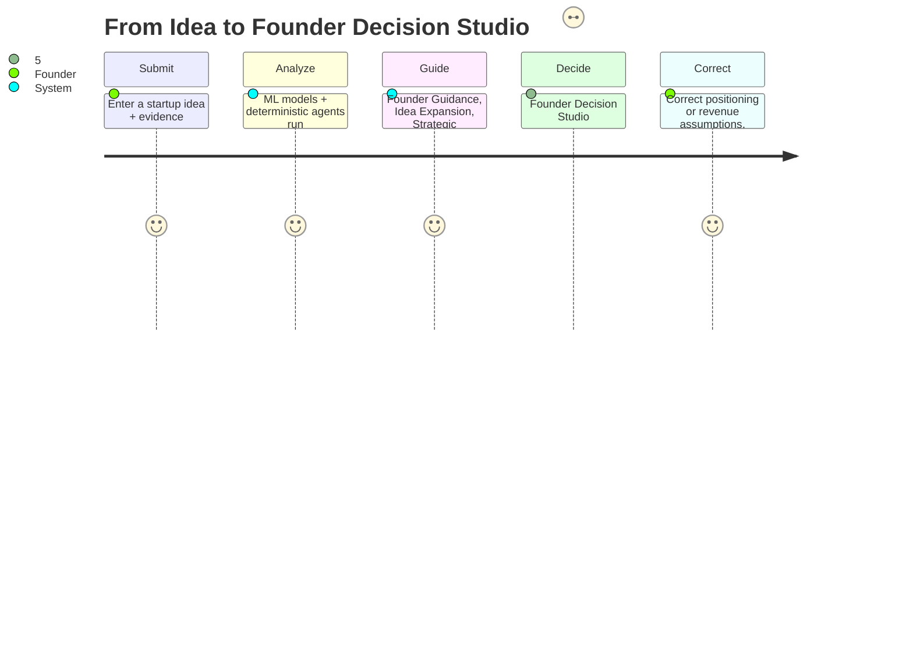
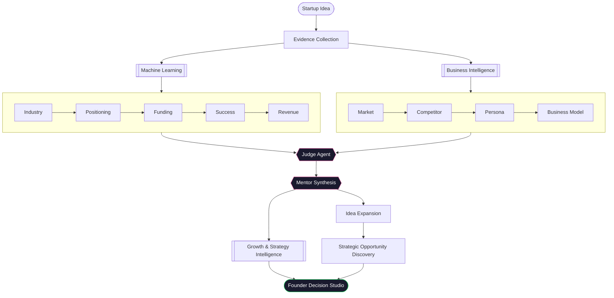
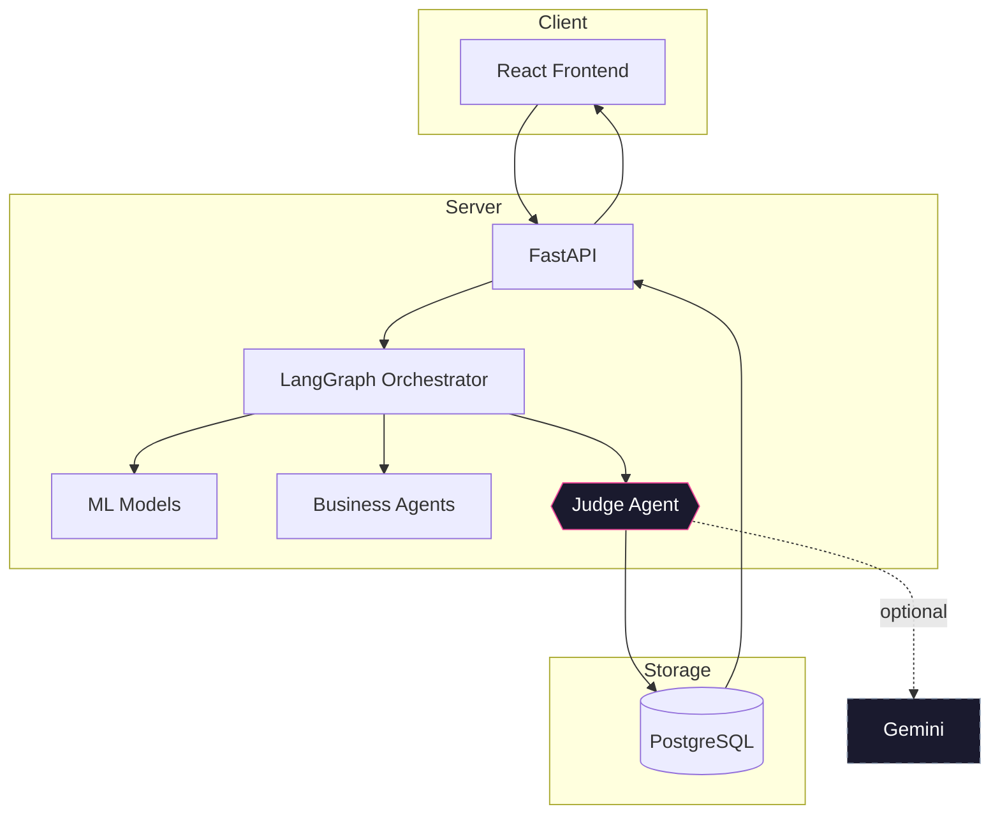
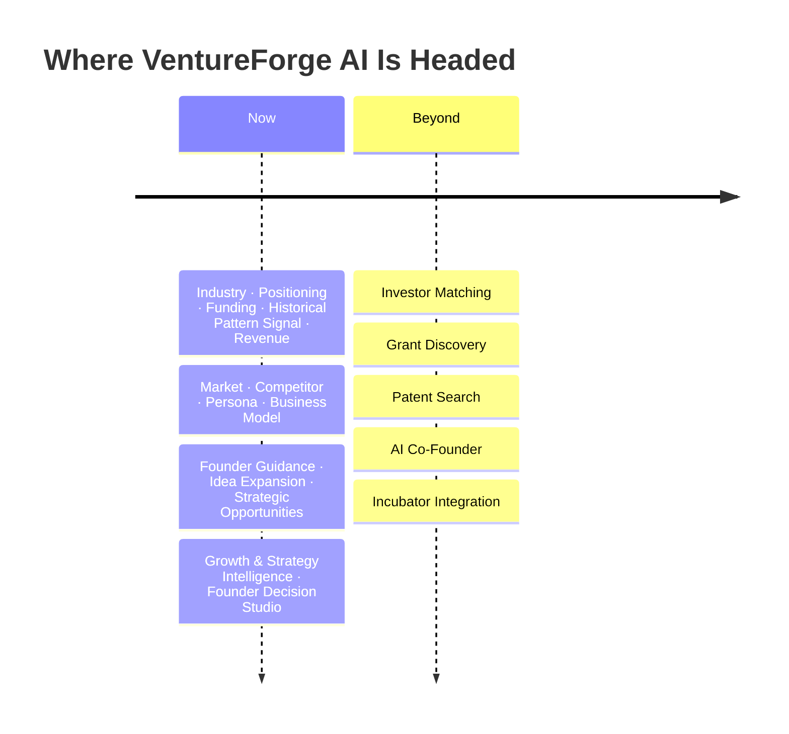

<div align="center">


### From Idea to Investor-Ready Startup in Minutes

Turn one startup idea into a full investor blueprint — industry fit, funding readiness, success signal, revenue outlook, market position, and a final verdict.

[](https://github.com/DivyaShreeS09/VentureForge-AI/actions/workflows/ci.yml)


<!-- Add hero banner at docs/assets/hero-banner.png (recommended 1600x700) -->

**[Product Journey](#product-journey)** · **[AI Workflow](#the-ai-workflow)** · **[Machine Learning](#machine-learning)** · **[Architecture](#architecture)** · **[Quick Start](#quick-start)**

</div>

<br/>

## The Problem

Validating a startup idea usually means a dozen scattered tools and a friend's opinion. Nothing tells you what it actually doesn't know.

**Most startup tools answer questions. VentureForge AI builds a decision path.**

## The Vision

VentureForge AI is designed as an AI-powered startup-building ecosystem, not merely an idea evaluator. It combines machine learning, business-intelligence agents, explainable decision support, and startup planning into one coordinated workflow — from concept validation to an investor-ready blueprint.

## Product Journey



### A Walkthrough

> *"An AI platform for early diabetic-foot risk detection."*

| Stage | What Comes Back |
|---|---|
| Startup Snapshot | Industry, target customer, business model, stage, investment readiness — one glance |
| Founder Decision Panel | One of *Should Build / Proceed Carefully / Needs Validation / High Risk*, with the exact reasoning |
| 90-Day Roadmap | First Week / First Month / Next 90 Days, each task prioritized and scoped |
| Market Expansion | Adjacent markets, expansion paths, partnerships, and a growth-channel plan — each with its own reasoning |
| Risk Dashboard | Strategic and planning risks, sorted by likelihood × impact, each with a mitigation |
| Investment Readiness | Funding readiness score, historical pattern signal, evidence quality — one unified view |
| Founder Mentor | A plain-language close ending in the week's three highest-impact actions |

*Illustrative — actual output depends entirely on the idea and evidence you submit.*

## Product Capabilities

| Machine Learning | Deterministic Business Agents |
|---|---|
| **Industry Classification** — identifies the startup's primary sector | **Market Intelligence, Competitor Analysis, Customer Persona, Business Model** — synthesize only the evidence submitted, never fabricate |
| **Historical Pattern Signal** — compares the idea against historical company outcomes, framed as a comparison, never a verdict | **Founder Guidance** — every readiness dimension becomes a coached, stage-aware guidance item, never a bare weakness label |
| **Funding Readiness** — evaluates investor preparedness across key dimensions | **Idea Expansion** — alternative segments, adjacent industries, feature ideas, pricing, pivots — each tiered confirmed / hypothesis / speculative |
| **Revenue Scenarios** — models conservative, base, and optimistic outlooks | **Strategic Opportunity Discovery** — reasons through *why* an adjacent market fits, not just that it exists |
| **Customer Segmentation** *(optional, when RFM data is supplied)* | **Growth & Strategy Intelligence** — ranked next actions, innovation opportunities, planning risks, growth channels, and a pitch-deck outline |

| Founder Decision Studio | Product |
|---|---|
| **Founder Decision Panel** — one clear recommendation, always paired with its reasoning, never a bare label | **Live Workflow Progress** — watch the pipeline run in real time |
| **Guided 9-section journey** — Snapshot → Why It Matters → Decision → Roadmap → Validation → Market Expansion → Risk Dashboard → Investment Readiness → Founder Mentor | **Founder-Initiated Corrections** — correct industry positioning or revenue assumptions and see every downstream section recompute |
| **Confidence Tiers** — every opportunity is confirmed-from-evidence, reasonable-hypothesis, or speculative — never blurred | **Analysis History** — every past run, saved |
| **Advanced: How We Got This** — full technical detail (model evidence, explainability, methodology), collapsed by default | **Structured Blueprint** — organizes the final findings into a reusable startup plan |

## Why Not Just a Chatbot?

| | Chatbot | VentureForge AI |
|---|---|---|
| Response | One opinion | A structured pipeline |
| Prediction | Generated on the spot | Trained models, tested on unseen data |
| Funding view | A narrative | A versioned scoring rubric |
| Success signal | Rarely offered | A trained estimate, not a guess |
| Missing info | A confident guess | Reported as a gap |
| Output | Advice | A reusable blueprint |

## The AI Workflow



| Module | Role in the Workflow |
|---|---|
| **Industry Classification** | Determines the startup's domain before the remaining analysis begins. |
| **Venture Positioning** | Resolves a founder-facing identity from a controlled taxonomy — distinct from, and more specific than, the raw industry classification above. |
| **Funding Readiness** | Evaluates whether the submitted idea contains the evidence investors expect. |
| **Historical Pattern Signal** | Compares the startup's characteristics with historical outcome patterns — a comparison, never a verdict on this specific idea. |
| **Revenue Estimation** | Produces conservative, base, and optimistic revenue scenarios. |
| **Market Intelligence, Competitor Analysis, Customer Persona, Business Model** | Deterministic business-intelligence agents synthesizing the founder's submitted evidence. |
| **Judge Agent** | Combines all model and agent outputs into one final evaluation, with an optional Gemini narrative layered on top — never replacing it. |
| **Mentor Synthesis** | Reconciles the Judge Agent's output and every business-intelligence agent's output into one coherent, founder-facing result — Founder Guidance items, verdict, validation plan, and 30/60/90 roadmap. |
| **Idea Expansion** | Alternative customer segments, adjacent industries, feature ideas, pricing models, and pivots — every suggestion tiered confirmed / hypothesis / speculative. |
| **Strategic Opportunity Discovery** | Reasons through *why* an adjacent market or future form fits — never a bare list — plus strategic risks and founder decision support per opportunity. |
| **Growth & Strategy Intelligence** | Customer segmentation (when RFM data is supplied), ranked next actions, innovation opportunities, planning risks, growth-channel recommendations, and a pitch-deck outline. |
| **Founder Decision Studio** | The final presentation layer — one guided 9-section founder journey (not a stack of independent report cards), with all technical detail collapsed into an Advanced section. |

## Machine Learning

| Model | What It Does | Performance |
|---|---|---|
| Industry Classifier | Selects the most relevant startup industry from seven categories | Macro F1: 0.776 — consistent performance across all categories |
| Success Predictor | Compares the startup with historical company outcomes | ROC-AUC: 0.855 — strong separation between outcome patterns |

Full methodology and dataset detail: [`ml/DATASETS.md`](ml/DATASETS.md).

## Architecture



## Tech Stack

| | |
|---|---|
| **Frontend** | React · TypeScript · TailwindCSS · Vite |
| **Backend** | FastAPI · SQLAlchemy · Alembic |
| **Database** | PostgreSQL |
| **Artificial Intelligence** | LangGraph · Google Gemini |
| **Machine Learning** | TF-IDF · Logistic Regression · HistGradientBoosting |
| **Evaluated Representations** | Sentence Transformers *(challenger, not used in the live classifier)* |
| **Explainable AI** | Feature Importance · Term Contributions · Confidence Calibration |
| **Data Processing** | pandas · NumPy · scikit-learn |
| **Testing** | pytest · Vitest · React Testing Library |

No caching layer, message queue, or Redis is part of the active runtime — PostgreSQL is the only
datastore. `docker-compose.yml` provisions PostgreSQL alone (for anyone who doesn't already have
it installed natively); there is no Redis client, queue, or cache anywhere in this codebase.

## Project Structure

| | |
|---|---|
| `backend/` | AI orchestration, FastAPI, Judge Agent, persistence |
| `frontend/` | React UI, workflow view, results, reports |
| `ml/` | Training, evaluation, feature engineering, explainability |

<!--
  Add after the frontend is finalized:

  docs/assets/hero-banner.png
  docs/assets/demo.gif
  docs/assets/screenshots/idea-input.png
  docs/assets/screenshots/workflow.png
  docs/assets/screenshots/results.png
  docs/assets/screenshots/explainability.png
  docs/assets/screenshots/report.png
-->

## Quick Start

```bash
git clone https://github.com/DivyaShreeS09/VentureForge-AI.git
cd VentureForge-AI
cp backend/.env.example backend/.env
cp frontend/.env.example frontend/.env

docker compose up -d                 # PostgreSQL — or use a native install

python -m venv backend/.venv
```

**Activate the virtual environment**

```bash
source backend/.venv/bin/activate    # macOS / Linux
```
```powershell
backend\.venv\Scripts\Activate.ps1   # Windows
```

```bash
pip install -r backend/requirements.txt -r ml/requirements.txt
cd frontend && npm install && cd ..

cd backend && alembic upgrade head && cd ..

python -m ml.src.training.train_industry_classifier
python -m ml.src.training.train_success_classifier
```

**Run it**

**Terminal 1 — Backend**
```bash
cd backend
uvicorn app.main:app --reload
```

**Terminal 2 — Frontend**
```bash
cd frontend
npm run dev
```

| | |
|---|---|
| App | http://localhost:5173 |
| API docs | http://127.0.0.1:8000/docs |
| Health | http://127.0.0.1:8000/api/v1/health |

Model training falls back to a small bootstrap dataset without a downloaded real dataset — logged clearly, never treated as the metrics above.

Stuck on setup? See [`docs/SETUP.md`](docs/SETUP.md).

## Configuration

| Variable | Purpose |
|---|---|
| `DATABASE_URL` | PostgreSQL connection string |
| `GEMINI_API_KEY` | Optional narrative layer |
| `VITE_API_BASE_URL` | Frontend → backend API URL |

Full reference (every variable, every file it lives in): [`docs/SETUP.md`](docs/SETUP.md#full-environment-reference).

**Before deploying anywhere beyond local development:** this project has no authentication,
sessions, or authorization layer by design — read [`docs/SECURITY.md`](docs/SECURITY.md) first.

## The Future of VentureForge



## Acknowledgements

Built with [FastAPI](https://fastapi.tiangolo.com/), [React](https://react.dev/), [LangGraph](https://langchain-ai.github.io/langgraph/), [scikit-learn](https://scikit-learn.org/), [PostgreSQL](https://www.postgresql.org/), [SQLAlchemy](https://www.sqlalchemy.org/), [Alembic](https://alembic.sqlalchemy.org/), and [TailwindCSS](https://tailwindcss.com/).
