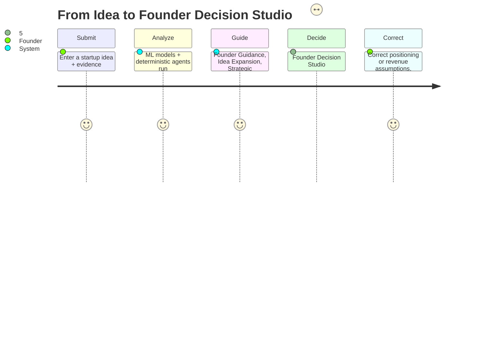
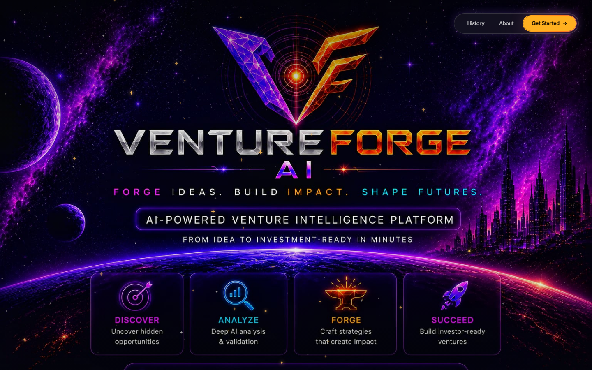
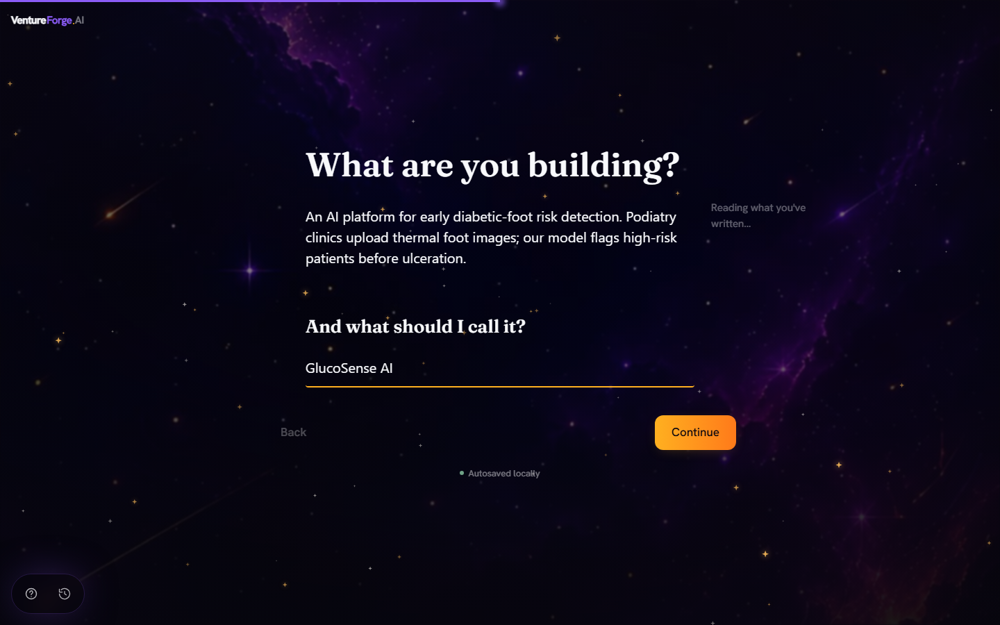
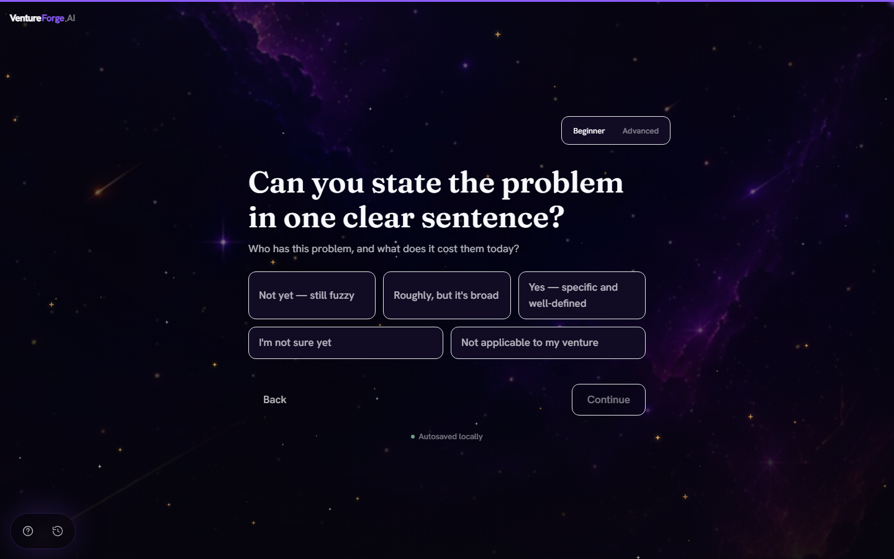
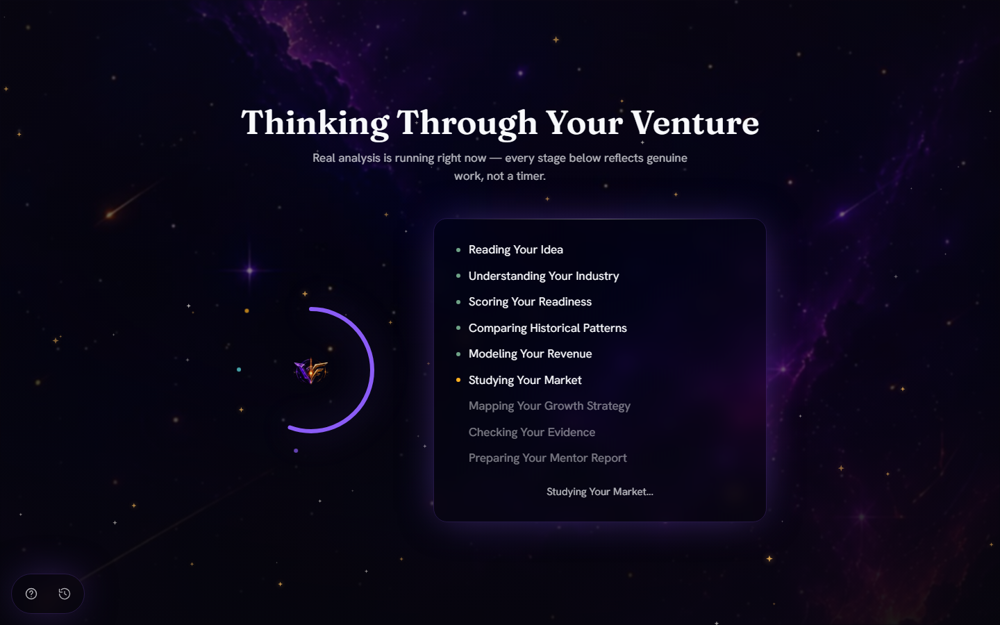
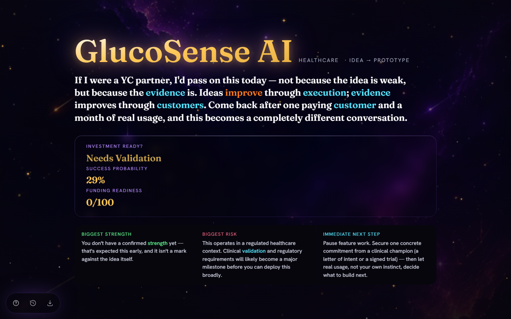
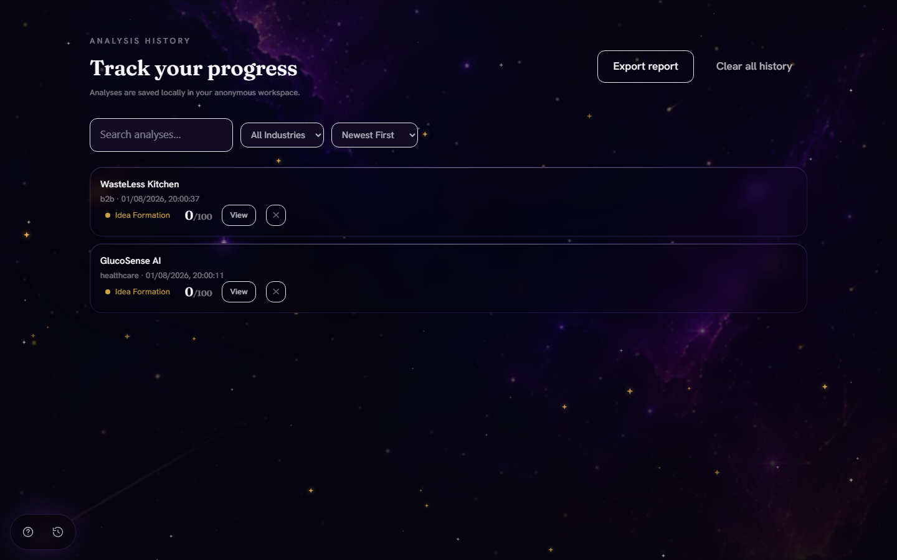
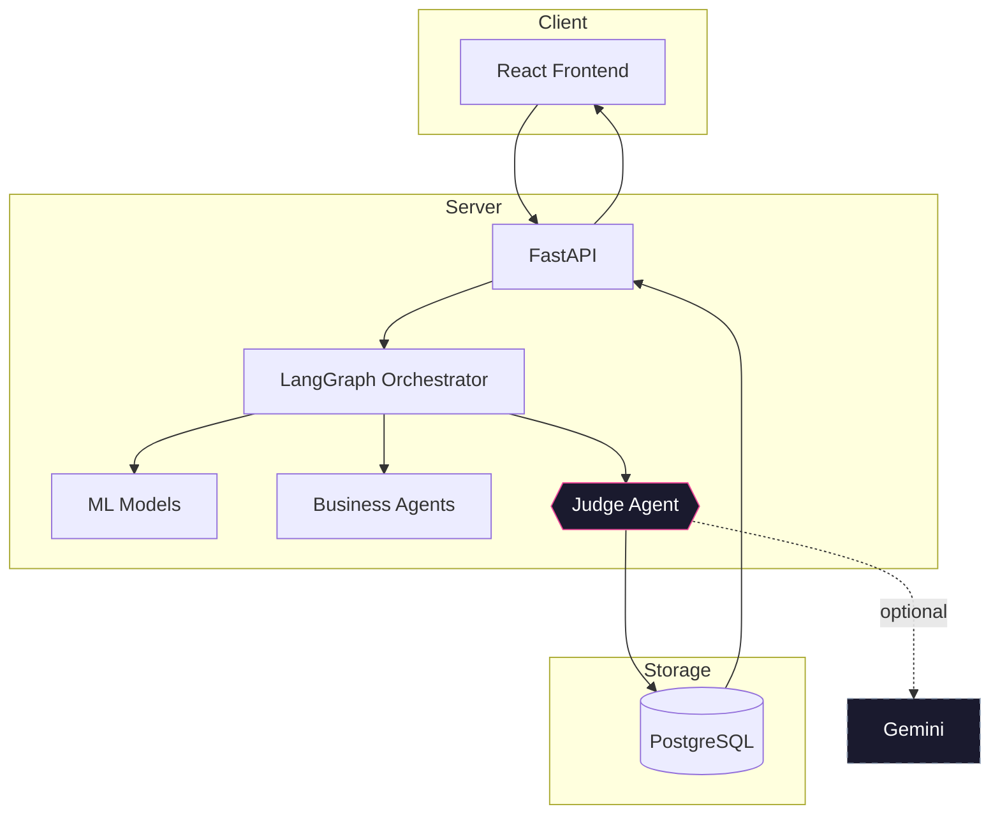
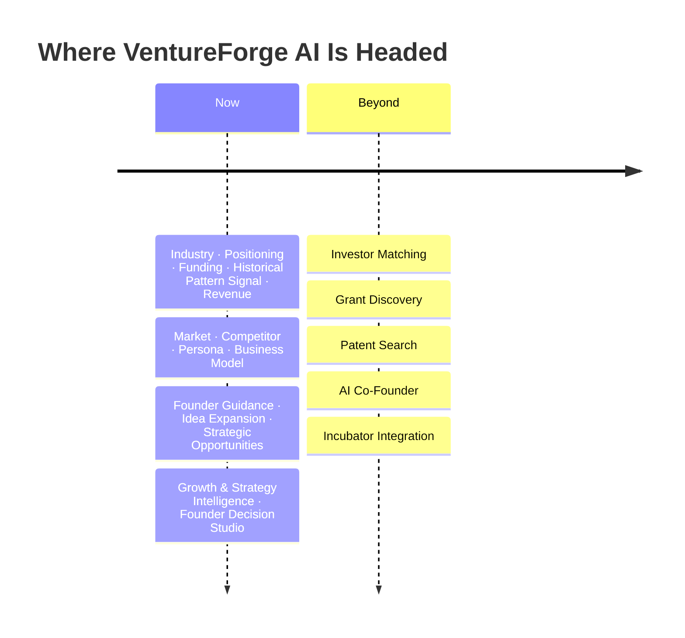

<div align="center">


### From Idea to Investor-Ready Startup in Minutes

Turn one startup idea into a full investor blueprint — industry fit, funding readiness, success signal, revenue outlook, market position, and a final verdict.

[](https://github.com/DivyaShreeS09/VentureForge-AI/actions/workflows/ci.yml)


**[Product Journey](#product-journey)** · **[AI Workflow](#the-ai-workflow)** · **[Machine Learning](#machine-learning)** · **[Architecture](#architecture)** · **[Quick Start](#quick-start)**

</div>

<br/>

## Live Demo

| | |
|---|---|
| Frontend | [ventureforge-ai-divyashrees09s-projects.vercel.app](https://ventureforge-ai-divyashrees09s-projects.vercel.app) |
| Backend API / API Docs | Deployed on Render (see [`render.yaml`](render.yaml)) — the exact hostname is assigned by Render at service-creation time and isn't committed to this repository, so it isn't listed here to avoid publishing a URL this README can't keep accurate. It's visible in the Render dashboard for this project, and the frontend above talks to it directly. |

<br/>

## Project Highlights

- **A coordinated pipeline, not a single prompt** — a LangGraph orchestrator sequences two trained ML models and 45 mostly-deterministic agent modules, then a rule-based Judge Agent synthesizes their output before an optional Gemini narrative is layered on top.
- **Trained, evaluated models — not vibes** — the industry classifier (TF-IDF + Logistic Regression) and success predictor (HistGradientBoosting) are both trained on real, licensed datasets and evaluated on held-out test data, with metrics published below and full methodology in [`ml/DATASETS.md`](ml/DATASETS.md).
- **Confidence-tiered, never fabricated** — every generated opportunity, expansion idea, or growth suggestion is explicitly tagged confirmed-from-evidence, reasonable-hypothesis, or speculative, and missing information is reported as a gap rather than guessed.
- **Founder Decision Studio** — a single 5-section results page (Executive Command Center, Executive Dashboard, Mission Control, Investor Review, Deep Analysis) that states each key fact exactly once and links every other mention back to it.
- **Founder-initiated corrections** — a founder can correct the industry positioning or revenue assumptions after the fact, and the Judge Agent and revenue scenarios genuinely recompute — not just a stored override.
- **Live, streamed progress** — Server-Sent Events push real workflow progress to the frontend while the pipeline runs, with a polling fallback.

## Project Statistics

| | |
|---|---|
| ML Models | 2 in production (Industry Classifier, Success Predictor) + 1 optional (Customer Segmentation, runs only when RFM data is supplied) |
| Business/AI Agent Modules | 45 (`backend/app/agents/`) — only 6 ever call Gemini; the rest are deterministic |
| API Endpoints | 12 (`backend/app/api/v1/`) |
| Database Tables | 2 (`startups`, `analyses`) |
| Automated Tests | 999 total — 724 backend (pytest), 190 frontend (Vitest), 85 ML (pytest) |
| CI | GitHub Actions, 3 parallel jobs (backend / frontend / ml) on every push and PR |
| Deployment | Render (backend + PostgreSQL), Vercel (frontend) |
| Tech Stack | React · TypeScript · FastAPI · PostgreSQL · LangGraph · scikit-learn |

## Features

- ✓ Industry Classification
- ✓ Funding Readiness
- ✓ Success Prediction (Historical Pattern Signal)
- ✓ Revenue Forecasting
- ✓ Market Intelligence
- ✓ Competitor Analysis
- ✓ Customer Persona
- ✓ Business Model Analysis
- ✓ Judge Agent
- ✓ Founder Decision Studio
- ✓ PDF Export
- ✓ Analysis History
- ✓ Live Progress (SSE)
- ✓ Founder-Initiated Corrections

## The Problem

Validating a startup idea usually means a dozen scattered tools and a friend's opinion. Nothing tells you what it actually doesn't know.

**Most startup tools answer questions. VentureForge AI builds a decision path.**

## The Vision

VentureForge AI is designed as an AI-powered startup-building ecosystem, not merely an idea evaluator. It combines machine learning, business-intelligence agents, explainable decision support, and startup planning into one coordinated workflow — from concept validation to an investor-ready blueprint.

## Product Journey



### A Walkthrough

> *"An AI platform for early diabetic-foot risk detection."*

| Section | What Comes Back |
|---|---|
| Executive Command Center | Startup name, industry, stage, one-sentence verdict — one of *Should Build / Proceed Carefully / Needs Validation / High Risk* — success probability, funding readiness, biggest strength, biggest risk, and the immediate next step |
| Executive Dashboard | The same signals as charts: funding-readiness radar, success/industry gauges, revenue-scenario bars, and a likelihood × impact risk grid |
| Mission Control | The top 3 next actions, each with its reasoning, difficulty, timeline, and definition of done |
| Investor Review | The questions an investor would ask, paired with VentureForge's answer and the evidence behind it |
| Deep Analysis | Full methodology, positioning correction tools, market/competitor/persona detail, and the complete founder report — collapsed by default |

*Illustrative — actual output depends entirely on the idea and evidence you submit.*

## Screenshots

Captured directly from a real local run of the app (Playwright, 1440×900, no mocked data).

<table>
<tr>
<td width="50%">

**Landing Page**


</td>
<td width="50%">

**Idea Submission**


</td>
</tr>
<tr>
<td width="50%">

**Evidence Collection**


</td>
<td width="50%">

**Analysis Progress**


</td>
</tr>
<tr>
<td width="50%">

**Founder Operating System (Results)**


</td>
<td width="50%">

**History**


</td>
</tr>
</table>

## Product Capabilities

| Machine Learning | Deterministic Business Agents |
|---|---|
| **Industry Classification** — identifies the startup's primary sector | **Market Intelligence, Competitor Analysis, Customer Persona, Business Model** — synthesize only the evidence submitted, never fabricate |
| **Historical Pattern Signal** — compares the idea against historical company outcomes, framed as a comparison, never a verdict | **Founder Guidance** — every readiness dimension becomes a coached, stage-aware guidance item, never a bare weakness label |
| **Funding Readiness** — evaluates investor preparedness across key dimensions | **Idea Expansion** — alternative segments, adjacent industries, feature ideas, pricing, pivots — each tiered confirmed / hypothesis / speculative |
| **Revenue Scenarios** — models conservative, base, and optimistic outlooks | **Strategic Opportunity Discovery** — reasons through *why* an adjacent market fits, not just that it exists |
| **Customer Segmentation** *(optional, when RFM data is supplied)* | **Growth & Strategy Intelligence** — ranked next actions, innovation opportunities, planning risks, growth channels, and a pitch-deck outline |

| Founder Decision Studio | Product |
|---|---|
| **Founder Decision Panel** — one clear recommendation, always paired with its reasoning, never a bare label | **Live Workflow Progress** — watch the pipeline run in real time |
| **5-section results page** — Executive Command Center → Executive Dashboard → Mission Control → Investor Review → Deep Analysis, each fact stated exactly once | **Founder-Initiated Corrections** — correct industry positioning or revenue assumptions and see the Judge Agent and revenue scenarios genuinely recompute |
| **Confidence Tiers** — every opportunity is confirmed-from-evidence, reasonable-hypothesis, or speculative — never blurred | **Analysis History** — every past run, saved |
| **Advanced: How We Got This** — full technical detail (model evidence, explainability, methodology), collapsed by default | **Structured Blueprint** — organizes the final findings into a reusable startup plan |

## Why Not Just a Chatbot?

| | Chatbot | VentureForge AI |
|---|---|---|
| Response | One opinion | A structured pipeline |
| Prediction | Generated on the spot | Trained models, tested on unseen data |
| Funding view | A narrative | A versioned scoring rubric |
| Success signal | Rarely offered | A trained estimate, not a guess |
| Missing info | A confident guess | Reported as a gap |
| Output | Advice | A reusable blueprint |

## The AI Workflow


| Module | Role in the Workflow |
|---|---|
| **Industry Classification** | Determines the startup's domain before the remaining analysis begins. |
| **Venture Positioning** | Resolves a founder-facing identity from a controlled taxonomy — distinct from, and more specific than, the raw industry classification above. |
| **Funding Readiness** | Evaluates whether the submitted idea contains the evidence investors expect. |
| **Historical Pattern Signal** | Compares the startup's characteristics with historical outcome patterns — a comparison, never a verdict on this specific idea. |
| **Revenue Estimation** | Produces conservative, base, and optimistic revenue scenarios. |
| **Market Intelligence, Competitor Analysis, Customer Persona, Business Model** | Deterministic business-intelligence agents synthesizing the founder's submitted evidence. |
| **Judge Agent** | Combines all model and agent outputs into one final evaluation, with an optional Gemini narrative layered on top — never replacing it. |
| **Mentor Synthesis** | Reconciles the Judge Agent's output and every business-intelligence agent's output into one coherent, founder-facing result — Founder Guidance items, verdict, validation plan, and 30/60/90 roadmap. |
| **Idea Expansion** | Alternative customer segments, adjacent industries, feature ideas, pricing models, and pivots — every suggestion tiered confirmed / hypothesis / speculative. |
| **Strategic Opportunity Discovery** | Reasons through *why* an adjacent market or future form fits — never a bare list — plus strategic risks and founder decision support per opportunity. |
| **Growth & Strategy Intelligence** | Customer segmentation (when RFM data is supplied), ranked next actions, innovation opportunities, planning risks, growth-channel recommendations, and a pitch-deck outline. |
| **Founder Decision Studio** | The final presentation layer — a 5-section results page (not a stack of independent report cards) where every recurring fact is stated once and linked from elsewhere, with all technical detail collapsed into a Deep Analysis section. |

### Multi-Agent Architecture

VentureForge AI is deliberately a multi-agent system, not one large prompt:

- 45 specialized modules cooperate under a LangGraph orchestrator, each responsible for one part of the analysis (industry, funding, competitors, revenue, growth, and so on).
- Only 6 of those 45 modules ever call an LLM (Gemini) — for narrative rephrasing and additional advisory suggestions, always with a safe fallback if it's unavailable.
- The remaining modules are deterministic: rule-based scoring, trained ML models, and template-driven synthesis — no LLM call, no hallucination risk.
- This split is intentional: deterministic logic gives reproducible, explainable results for the load-bearing decisions (funding score, positioning, the Judge Agent's verdict), while the LLM is reserved for the parts of the output that genuinely benefit from open-ended language — narrative phrasing and supplementary advice, never the underlying facts or numbers.

### Judge Agent

The Judge Agent (`backend/app/agents/judge.py`) is the single point where every model and agent output is combined into one final evaluation:

- It is **entirely deterministic** — it has zero imports from the AI/Gemini layer, so its verdict, scores, and reasoning are the same for the same input every time.
- It synthesizes the ML predictions (industry, success signal, funding readiness, revenue scenarios) together with every business-intelligence agent's output (market, competitor, persona, business model) into one coherent judgment.
- An optional Gemini narrative is layered on **afterward**, purely to improve how the result reads — it can add explanatory language but can never change a score, a verdict, or a fact the Judge Agent already decided.
- If Gemini is unconfigured, unreachable, or returns something unusable, the Judge Agent's deterministic output is returned unchanged — there is no code path where the narrative layer is required for a correct result.

## Machine Learning

| Model | What It Does | Performance |
|---|---|---|
| Industry Classifier | Selects the most relevant startup industry from seven categories | Macro F1: 0.769, top-2 accuracy: 0.960 (held-out test set) |
| Success Predictor | Compares the startup with historical company outcomes | ROC-AUC: 0.838, MCC: 0.512 (held-out test set) |

Full methodology and dataset detail: [`ml/DATASETS.md`](ml/DATASETS.md).

## Architecture



## Tech Stack

| | |
|---|---|
| **Frontend** | React · TypeScript · TailwindCSS · Vite |
| **Backend** | FastAPI · SQLAlchemy · Alembic |
| **Database** | PostgreSQL |
| **Artificial Intelligence** | LangGraph · Google Gemini |
| **Machine Learning** | TF-IDF · Logistic Regression · HistGradientBoosting |
| **Evaluated Representations** | Sentence Transformers *(challenger, not used in the live classifier)* |
| **Explainable AI** | Global permutation feature importance, TF-IDF term contributions, confidence calibration, and a custom local (per-prediction) finite-difference attribution method — not SHAP |
| **Data Processing** | pandas · NumPy · scikit-learn |
| **Testing** | pytest · Vitest · React Testing Library |

No caching layer, message queue, or Redis is part of the active runtime — PostgreSQL is the only
datastore. `docker-compose.yml` provisions PostgreSQL alone (for anyone who doesn't already have
it installed natively); there is no Redis client, queue, or cache anywhere in this codebase.

The success predictor's local explainer (`backend/app/ml/local_success_explainer.py`) can attach
`shap.TreeExplainer` when the underlying estimator is an uncalibrated tree model, but the
production artifact is calibration-wrapped, so that path isn't taken in practice; `shap` also
isn't a declared dependency in `backend/requirements.txt`. The per-prediction explanation actually
served is a documented leave-one-out finite-difference method — real, but not SHAP.

## Project Structure

| | |
|---|---|
| `backend/` | AI orchestration, FastAPI, Judge Agent, persistence |
| `frontend/` | React UI, workflow view, results, reports |
| `ml/` | Training, evaluation, feature engineering, explainability |

## Quick Start

```bash
git clone https://github.com/DivyaShreeS09/VentureForge-AI.git
cd VentureForge-AI
cp backend/.env.example backend/.env
cp frontend/.env.example frontend/.env

docker compose up -d                 # PostgreSQL — or use a native install

python -m venv backend/.venv
```

**Activate the virtual environment**

```bash
source backend/.venv/bin/activate    # macOS / Linux
```
```powershell
backend\.venv\Scripts\Activate.ps1   # Windows
```

```bash
pip install -r backend/requirements.txt -r ml/requirements.txt
cd frontend && npm install && cd ..

cd backend && alembic upgrade head && cd ..

python -m ml.src.training.train_industry_classifier
python -m ml.src.training.train_success_classifier
```

**Run it**

**Terminal 1 — Backend**
```bash
cd backend
uvicorn app.main:app --reload
```

**Terminal 2 — Frontend**
```bash
cd frontend
npm run dev
```

| | |
|---|---|
| App | http://localhost:5173 |
| API docs | http://127.0.0.1:8000/docs |
| Health | http://127.0.0.1:8000/api/v1/health |

Model training falls back to a small bootstrap dataset without a downloaded real dataset — logged clearly, never treated as the metrics above.

Stuck on setup? See [`docs/SETUP.md`](docs/SETUP.md).

## Configuration

| Variable | Purpose |
|---|---|
| `DATABASE_URL` | PostgreSQL connection string |
| `GEMINI_API_KEY` | Optional narrative layer |
| `VITE_API_BASE_URL` | Frontend → backend API URL |

Full reference (every variable, every file it lives in): [`docs/SETUP.md`](docs/SETUP.md#full-environment-reference).

**Before deploying anywhere beyond local development:** this project has no authentication,
sessions, or authorization layer by design — read [`docs/SECURITY.md`](docs/SECURITY.md) first.

## Deployment

| | |
|---|---|
| Frontend | Vercel — static build (`npm run build`), SPA rewrite so client-side routing survives a hard refresh (see [`frontend/vercel.json`](frontend/vercel.json)) |
| Backend | Render — `render.yaml` builds and starts the FastAPI app; `alembic upgrade head` runs automatically on every deploy before `uvicorn` starts |
| Database | PostgreSQL, managed by Render (see the `databases:` block in [`render.yaml`](render.yaml)) |
| Health check | `GET /api/v1/health`, configured as Render's `healthCheckPath` |
| CI | GitHub Actions ([`ci.yml`](.github/workflows/ci.yml)) — separate backend, frontend, and ML jobs run on every push/PR; CI does not itself deploy |

## Known Limitations

- **No authentication or authorization** — any client that can reach the API can read or trigger
  analyses for any startup. Acceptable for a demo/hackathon deployment, not for production use
  with real user data. See [`docs/SECURITY.md`](docs/SECURITY.md).
- **Both ML models are trained on English-language, YC-affiliated startup data** — the industry
  classifier has not been evaluated against non-YC or non-English company descriptions, and
  b2b/consumer is its dominant confusion pair.
- **The success predictor is a historical comparison, not a prediction about this specific idea**
  — it compares submitted metrics against resolved Crunchbase outcomes (acquired/IPO vs. closed)
  and leans heavily on cumulative funding raised as a signal.
- **Customer segmentation only runs when RFM data is supplied** — it is not computed from the
  idea description alone, so most analyses won't include it.
- **Live progress (SSE) is served in-process** — it does not use a pub/sub backend, so it will not
  work correctly if the API is ever scaled to multiple horizontal instances without further work.
- **Render's free tier cold-starts** — the backend can take up to ~30 seconds to respond to the
  first request after a period of inactivity.

## The Future of VentureForge



## Acknowledgements

Built with [FastAPI](https://fastapi.tiangolo.com/), [React](https://react.dev/), [LangGraph](https://langchain-ai.github.io/langgraph/), [scikit-learn](https://scikit-learn.org/), [PostgreSQL](https://www.postgresql.org/), [SQLAlchemy](https://www.sqlalchemy.org/), [Alembic](https://alembic.sqlalchemy.org/), and [TailwindCSS](https://tailwindcss.com/).
